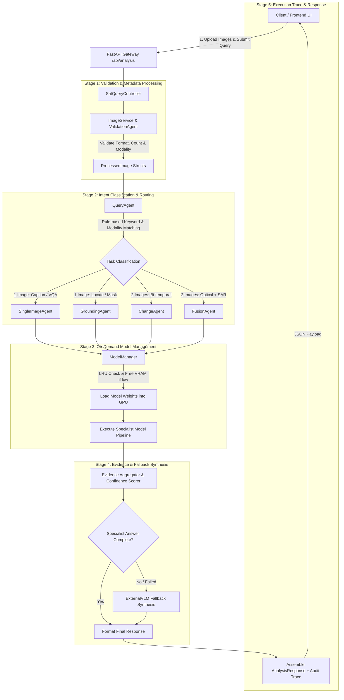

# 🛰️ SatQuery AI — System Workflow & Architecture Specification

## 1. Overview
**SatQuery AI** is an Agentic Vision-Language Assistant built for remote-sensing image analysis. Rather than forwarding every image request to a generic Vision-Language Model (VLM), SatQuery AI employs a modular multi-agent orchestration architecture led by a central **Master Controller (`SatQueryController`)**.

The workflow classifies natural language user queries, assesses image metadata and modalities (Optical, SAR, Multispectral), lazy-loads specialized deep learning model weights into VRAM on demand with LRU memory management, executes specialized visual tasks, synthesizes evidence-grounded answers with confidence scoring, and produces audit-ready execution traces.

---

## 2. Complete Tech Stack Specification

| Layer | Component / Tool | Version / Details | Purpose |
| :--- | :--- | :--- | :--- |
| **Frontend Framework** | Next.js | `v16.3` (React 19) | Modern SSR/SSG web application framework |
| **Frontend Styling** | Tailwind CSS | `v4.0` | Utility-first CSS styling and responsive layout engine |
| **UI Components & Icons** | Lucide React | `v1.33` | Modern icon system for UI interaction |
| **3D & Visualizations** | Three.js | `v0.185` | 3D visual rendering for geospatial scene displays |
| **Backend API Gateway** | FastAPI | `v0.115` (Python 3.12) | High-performance asynchronous web framework |
| **ASGI Web Server** | Uvicorn | `v0.34` | Asynchronous web application interface server |
| **Data Validation** | Pydantic | `v2.10` (`pydantic-settings`) | Data validation and environment configuration parsing |
| **Database & Persistence** | Supabase / PostgreSQL | `asyncpg` `v0.30`, SQLAlchemy `v2.0` | Relational storage for trace logs, user history & reports |
| **Core Deep Learning** | PyTorch | `v2.6` (`torch`, `torchvision`) | GPU-accelerated tensor computing and model execution |
| **Model Hub & Transformers** | Hugging Face Hub | `transformers` `v4.48`, `accelerate` | Model weight loading, tokenization & pipeline execution |
| **Quantization & Fine-Tuning** | BitsAndBytes / PEFT | `bitsandbytes` `v0.45`, `peft` `v0.14` | 4-bit / 8-bit quantization & Parameter-Efficient Fine-Tuning |
| **Remote Sensing VLM** | GeoChat | Specialized VLM | Zero-shot visual question answering & scene captioning |
| **Object Grounding Model** | Grounding DINO | Open-vocabulary detector | Text-guided bounding box detection on satellite imagery |
| **Segmentation Model** | SAM 2 (Segment Anything) | High-precision segmentation | Pixel-accurate mask generation for identified objects |
| **Change Detection Model** | ChangeFormer | Bi-temporal Transformer | Feature alignment and change map generation for image pairs |
| **Cross-Modal Fusion Model** | AnySat | Optical + SAR Fusion | Cross-attention alignment for multi-sensor imagery pairs |
| **External Synthesis Fallback**| Groq API / Gemini API | External VLM | Structured evidence synthesis & natural language fallback |
| **Geospatial Processing** | Rasterio, GeoPandas, Shapely | `rasterio` `v1.4`, `geopandas` `v1.0` | Raster manipulation, vector operations & coordinate projections |
| **Computer Vision Stack** | OpenCV, Pillow, Scikit-Image | `opencv-python-headless`, Pillow `v11.1` | Array manipulation, mask rendering & raster filtering |
| **Reverse Proxy / Ingress** | Nginx | `nginx:latest` | Host routing, static asset serving, CORS header control |
| **Containerization & Compute** | Docker & NVIDIA Docker | Docker Compose `v3.8` | Container orchestration with direct GPU passthrough (`nvidia-driver`) |

---

## 3. End-to-End Workflow Diagram



---

## 4. Detailed Workflow Pipeline Stages

### Stage 1: Request Intake & Input Validation
1. **API Endpoint Intake**: Client posts a request containing a natural language `query` and 1 or 2 uploaded image files to `/api/analysis` (or `/api/upload` first).
2. **Validation (`validation_agent.py` & `image_service.py`)**:
   - Checks file format support (`.png`, `.jpg`, `.jpeg`, `.tif`, `.tiff`).
   - Assesses image dimensions, channels, and spatial compatibility.
   - Infers or reads modality (`OPTICAL`, `SAR`, `MULTISPECTRAL`).
   - Normalizes image paths and stores transient upload metadata.

### Stage 2: Query Classification & Agent Selection (`query_agent.py`)
1. **Pattern & Keyword Matching**: Deterministic regex matching classifies user intent without overhead:
   - **`CAPTION`**: Queries asking for description (`describe`, `summarize`, `overview`). Target Tool: `geochat`.
   - **`GROUNDING`**: Queries asking to locate objects (`find`, `locate`, `where is`). Target Tool: `grounding_dino`.
   - **`SEGMENTATION`**: Queries asking for precise masks (`segment`, `mask`, `outline`). Target Tools: `grounding_dino` + `sam2`.
   - **`CHANGE_DETECTION`**: Queries requesting change maps (`detect change`, `change map`). Target Tool: `change_model`.
   - **`CHANGE_VQA`**: Queries asking what changed between bi-temporal pairs. Target Tools: `change_model` + `geochat`.
   - **`OPTICAL_SAR_ANALYSIS`**: Queries involving cross-modal pairs (Optical + SAR). Target Tools: `fusion_model` + `geochat`.
   - **`SINGLE_VQA`**: General single-image questions. Target Tool: `geochat`.
2. **Decision Record**: Generates an `AgentDecision` logged directly into the execution trace.

### Stage 3: Dynamic Model Lifecycle & VRAM Allocation (`ModelManager`)
1. **Lazy Loading**: Models (`GeoChat`, `Grounding DINO`, `SAM 2`, `ChangeFormer`, `AnySat Fusion`, `ExternalVLM`) are registered on startup but not loaded into memory until requested.
2. **Mutual Exclusion**: Asynchronous locks (`asyncio.Lock`) prevent race conditions when concurrent requests request the same model.
3. **LRU VRAM Eviction**: If GPU free memory drops below the required threshold for a model:
   - Evaluates least recently used loaded models.
   - Unloads the victim model (`model.unload()`).
   - Invokes `torch.cuda.empty_cache()` to free memory before loading the target model.
4. **Fallback Handling**: Falls back gracefully to CPU or external VLM endpoints if CUDA memory allocation fails.

### Stage 4: Specialist Agent Execution
- **`SingleImageAgent`**: Invokes GeoChat VLM for zero-shot VQA and scene captioning.
- **`GroundingAgent`**: Pipeline combining Grounding DINO (bounding box detection) and Segment Anything Model 2 (SAM 2) for pixel-accurate mask generation.
- **`ChangeAgent`**: Runs ChangeFormer model on co-registered bi-temporal image pairs to yield binary/multiclass change maps and change summary metrics.
- **`FusionAgent`**: Leverages cross-attention fusion models (e.g., AnySat architecture) to align Optical and SAR feature maps for weather/cloud-resilient spatial reasoning.

### Stage 5: Evidence Aggregation, Confidence Scoring & Fallback
1. **Evidence Structure**: Aggregates bounding boxes, masks, scalar metrics, and visual artifacts into standardized `EvidenceItem` objects.
2. **Confidence Calculation**: Computes confidence level (`HIGH`, `MEDIUM`, `LOW`) based on model output scores, spatial alignment, and execution sanity checks.
3. **Fallback Trigger**: If a specialist model fails or returns incomplete textual answers, the controller invokes `ExternalVLM` (e.g., Groq/Gemini API) to synthesize an explanation using structured evidence context.

### Stage 6: Execution Trace & Response Delivery
1. **Audit Trace**: Accumulates all execution steps, timestamps, model IDs, tool decisions, latencies, warnings, and errors in an `ExecutionTrace` schema.
2. **Response Generation**: Formats and returns the `AnalysisResponse` JSON to the client interface for interactive rendering.

---

## 5. API Endpoints Reference

| Method | Endpoint | Description |
| :--- | :--- | :--- |
| `POST` | `/api/upload` | Uploads remote sensing images and returns file references and metadata. |
| `POST` | `/api/analysis` | Processes user query + images through the master agent orchestrator. |
| `GET` | `/api/models` | Returns status, device allocation, and memory usage of all registered models. |
| `GET` | `/api/reports/{id}` | Retrieves past execution traces, report artifacts, and generated masks. |
| `GET` | `/api/health` | System health check, database status, and GPU utilization metrics. |

---

## 6. System Execution Architecture

```
[ Frontend: Next.js + Tailwind CSS ]
               │
               │ HTTP / JSON API
               ▼
[ Backend: FastAPI Gateway ]
       ├── app/api/router.py
       └── app/agents/controller.py (Master Orchestrator)
               │
               ├──> QueryAgent (Intent Classification)
               ├──> ValidationAgent (Format & Modality Validation)
               ├──> Specialist Agents (SingleImage, Grounding, Change, Fusion)
               │         │
               │         ▼
               └──> ModelManager (Lazy Loading / LRU VRAM Management)
                         ├── GeoChat (VQA / Captioning)
                         ├── Grounding DINO (Object Grounding)
                         ├── SAM 2 (Segment Anything)
                         ├── ChangeFormer (Bi-temporal Change)
                         ├── AnySat Fusion (Optical + SAR)
                         └── ExternalVLM (Fallback Synthesis)
```

---

## 7. Development & Deployment Operational Commands

### Local Development Setup
```bash
# Backend Execution
cd backend
pip install -r requirements.txt
python -m uvicorn app.main:app --host 0.0.0.0 --port 8000 --reload

# Frontend Execution
cd frontend
npm install
npm run dev
```

### Docker Container Orchestration
```bash
# Build and run containers (Backend + Frontend + Nginx + GPU Reservation)
docker-compose up --build -d

# Verify Container Logs
docker-compose logs -f backend
```

### Model Checkpoint Verification
```bash
# Download required model weights
python scripts/download_models.py

# Verify model loading and inference sanity
python scripts/test_models.py
```
